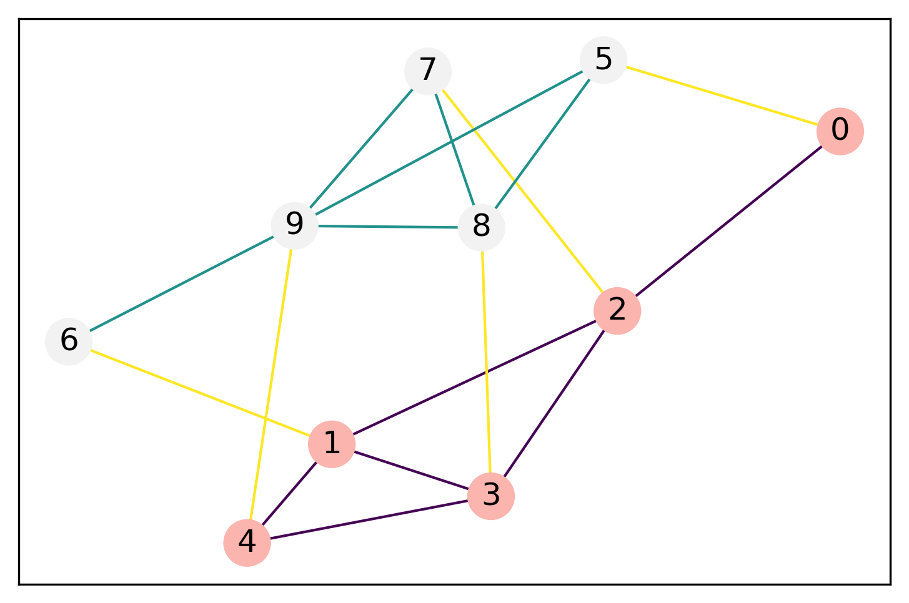
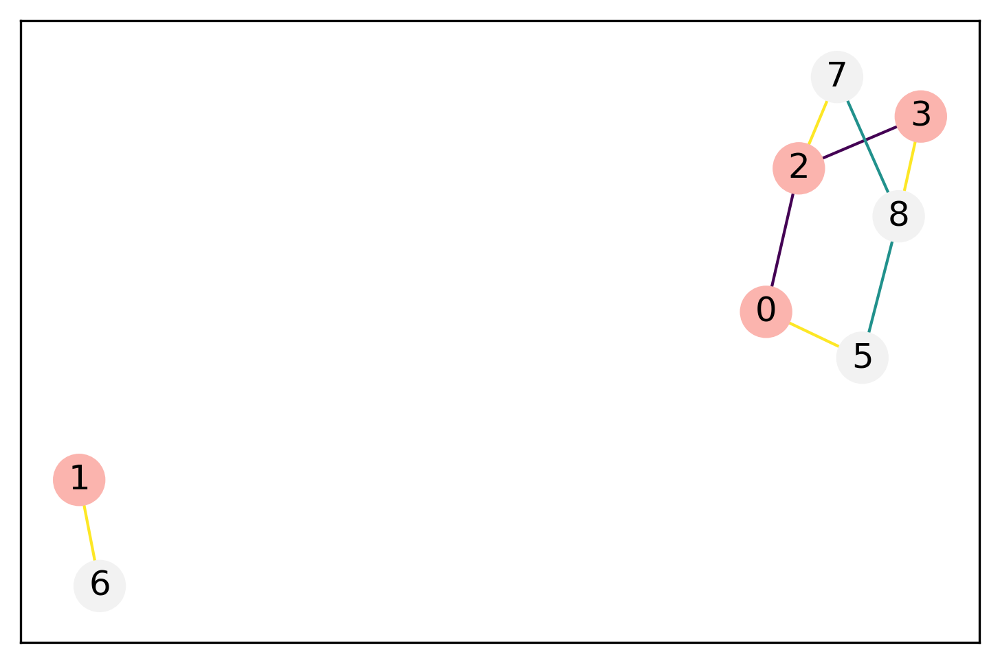
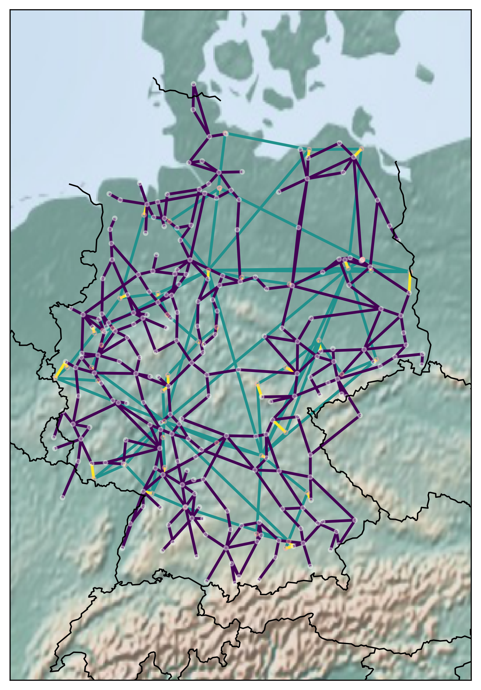
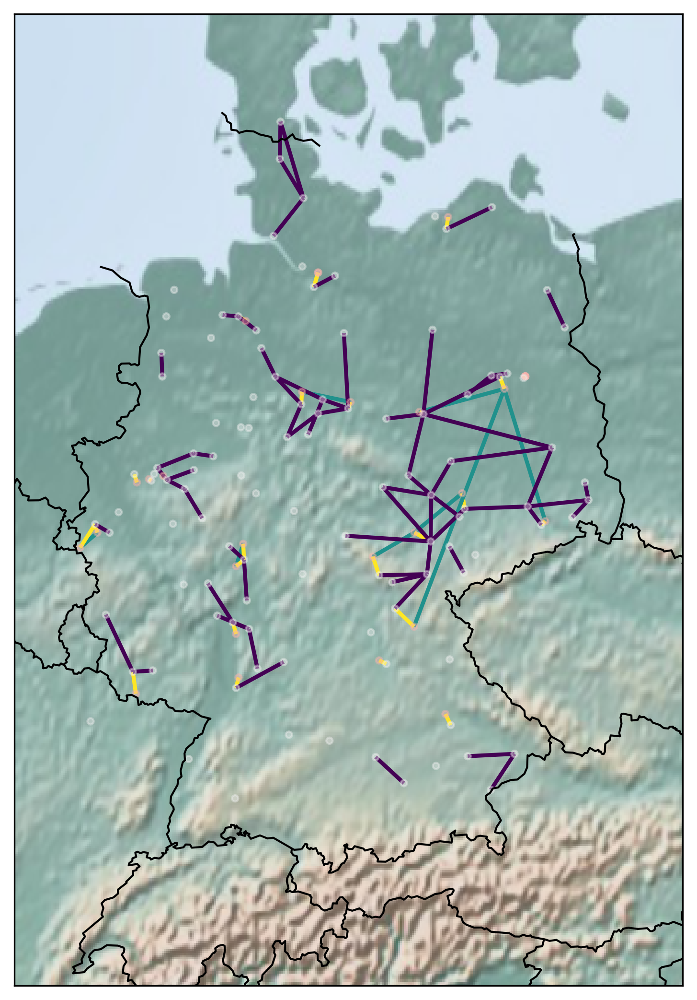
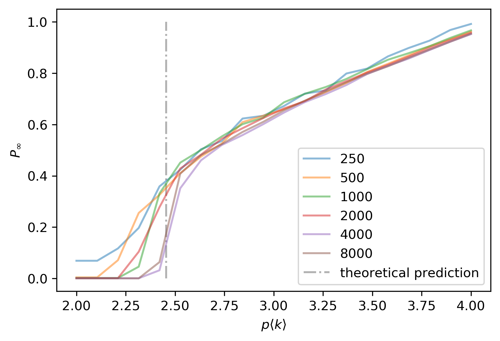

# Network Science Project
Networks today become increasingly interdependent, which makes them more susceptible to random node failure. A random removal of a small number of nodes from one network can lead to a cascade of failures in several connected networks, potentially even result in a complete fragmentation of the system. Therefore, the characteristics of interacting networks differs substantially from single, non-interacting networks. As we follow closely the approach of Buldyrev et al. (2010) in the analysis of node failures in interdependent networks, we include both a real-world example of a network, as well as differently specified random networks to simulate the iterative process of a cascade of failures. The aim of this project is to be able to understand the robustness of interacting networks. As a result, we find that both our real-world and random Erdös-Re ́yni interdependent networks are in fact very fragile. Furthermore, we find some evidence that interdependent scale-free networks are susceptible to fragmentation when attacked with the cascading failure process.

### Example of Failure Process in Interconnected Networks
|||
|-|-|
|Original Interdependent Network   | Network after Cascade of Failure in Interconnected Network|
|   |   |

### Real-World Example of Failure Process
|||
|-|-|
|Real-World Interdependent Network: German Power Grid and Internet Network | Network after Cascade of Failure on the Power Grid|
|   |   |

### Result of Failure Process in Simulated Random Networks

Buldyrev, Sergey V., Roni Parshani, Gerald Paul, H. Eugene Stanley, and Shlomo Havlin (Apr. 2010) “Catastrophic cascade of failures in interdependent networks”. In: Nature 464.7291, pp. 1025–1028. ISSN: 0028-0836, 1476-4687. DOI: 10.1038/nature08932.
